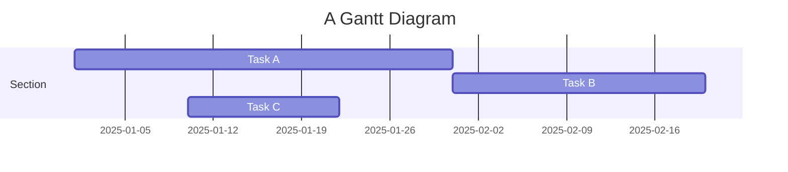
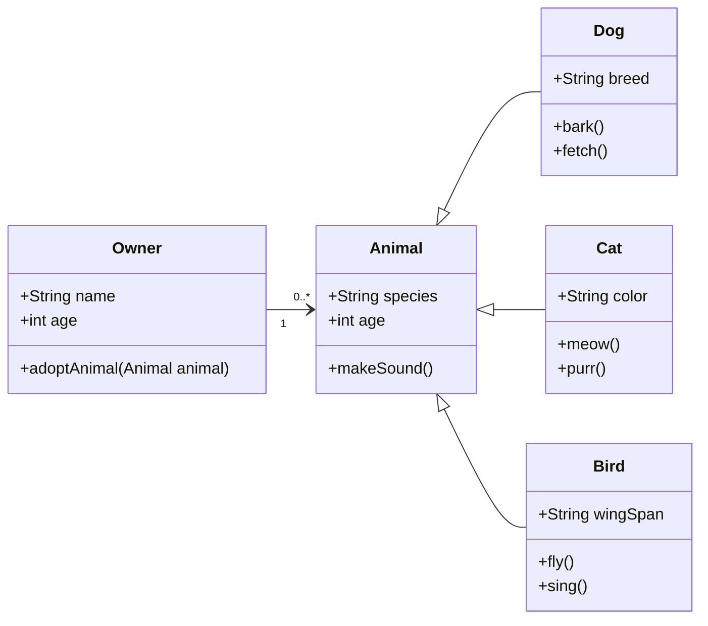

## Citations

Citations are then used in the article body with the `<d-cite>` tag.
The key attribute is a reference to the id provided in the bibliography.
The key attribute can take multiple ids, separated by commas.

The citation is presented inline like this: <d-cite key="gregor2015draw"></d-cite> (a number that displays more information on hover).
If you have an appendix, a bibliography is automatically created and populated in it.

Distill chose a numerical inline citation style to improve readability of citation dense articles and because many of the benefits of longer citations are obviated by displaying more information on hover.
However, we consider it good style to mention author last names if you discuss something at length and it fits into the flow well — the authors are human and it’s nice for them to have the community associate them with their work.

---

## Footnotes

Just wrap the text you would like to show up in a footnote in a `<d-footnote>` tag.
The number of the footnote will be automatically generated.<d-footnote>This will become a hoverable footnote.</d-footnote>

---

## Code Blocks

Syntax highlighting is provided within `<d-code>` tags.
An example of inline code snippets: `<d-code language="html">let x = 10;</d-code>`.
For larger blocks of code, add a `block` attribute:

<d-code block language="javascript">
  var x = 25;
  function(x) {
    return x * x;
  }
</d-code>

**Note:** `<d-code>` blocks do not look good in the dark mode. You can instead use the standard Jekyll syntax highlight with the `highlight` liquid tag.


var x = 25;
function(x) {
return x \* x;
}


You can also write standard Markdown code blocks in triple ticks with a language tag, for instance:

```python
def foo(x):
  return x
```

---

## Interactive Plots

You can add interative plots using plotly + iframes :framed_picture:

<div class="l-page">
  <iframe src="{{ '/assets/plotly/demo.html' | relative_url }}" frameborder='0' scrolling='no' height="500px" width="100%" style="border: 1px dashed grey;"></iframe>
</div>

The plot must be generated separately and saved into an HTML file.
To generate the plot that you see above, you can use the following code snippet:


import pandas as pd
import plotly.express as px
df = pd.read_csv(
'https://raw.githubusercontent.com/plotly/datasets/master/earthquakes-23k.csv'
)
fig = px.density_mapbox(
df,
lat='Latitude',
lon='Longitude',
z='Magnitude',
radius=10,
center=dict(lat=0, lon=180),
zoom=0,
mapbox_style="stamen-terrain",
)
fig.show()
fig.write_html('assets/plotly/demo.html')


---

## Details boxes

Details boxes are collapsible boxes which hide additional information from the user. They can be added with the `details` liquid tag:


Additional details, where math $$ 2x - 1 $$ and `code` is rendered correctly.


---

## Mermaid

This theme supports creating diagrams directly in markdown using [Mermaid](https://mermaid.js.org/). Mermaid enables users to render flowcharts, sequence diagrams, class diagrams, Gantt charts, and more. Simply embed the diagram syntax within a mermaid code block.

To create a Gantt chart, you can use the following syntax:

````markdown

````

And here’s how it will be rendered:


Similarly, you can also use it to create beautiful class diagrams:

````

````

It will be presented as:


With Mermaid, you can easily add clear and dynamic diagrams to enhance your blog content.

